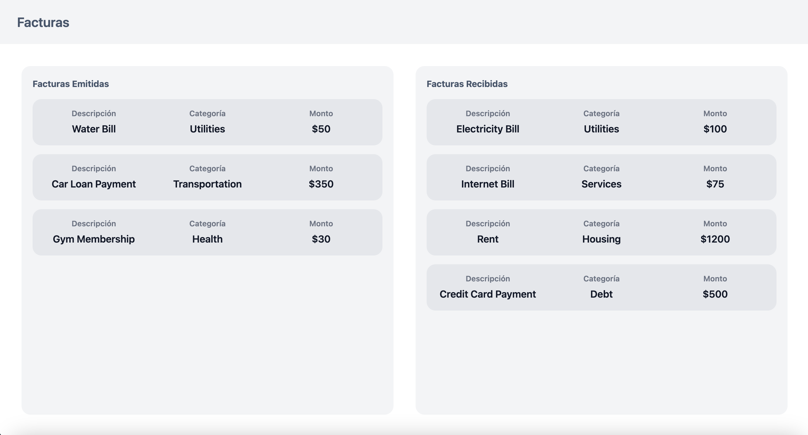

# Prueba Técnica React - Aplicación de Facturas

## Descripción

Esta prueba técnica consiste en desarrollar una aplicación en **React** con **TypeScript** y **Vite** que permita:
1. Correr un **json-server** a partir de un json proporcionado en react
2. **Obtener** una lista de facturas desde una API simulada.
3. **Clasificar** las facturas en dos columnas:
   - **Recibidas (Tipo 0)**.
   - **Emitidas (Tipo 1)**.
4. Mostrar un **loader** mientras los datos están cargándose.
5. Mostrar un mensaje de **error** en caso de fallo.
6. Informar si no hay **datos disponibles** por columna
6. El diseño debe seguir la estructura de dos columnas en pantallas grandes. Al reducir el tamaño de la pantalla, las columnas deben ajustarse para mostrar las facturas una sobre otra (diseño responsivo).
7. El **header** debe permanecer fijo en la parte superior de la página en todo momento. Cuando el usuario haga scroll para ver las facturas, estas deben desplazarse por debajo del header.

## Imagen
